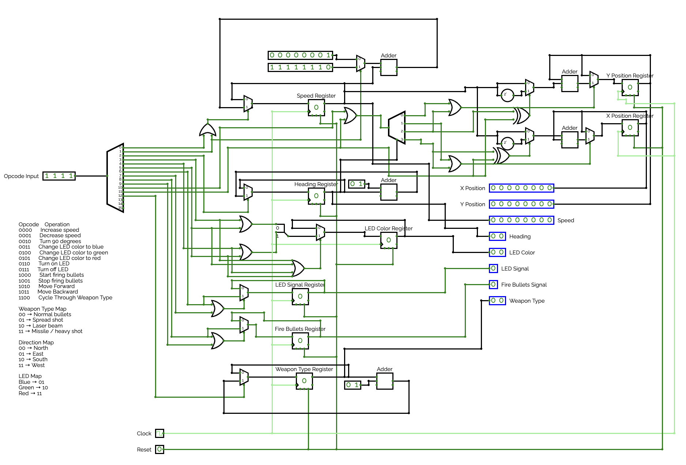

## Component Diagram

[CircuitVerse Project Link](https://circuitverse.org/users/413178/projects/robot-03cbcf2f-4fcf-447c-bf3a-e71604f0f60a)

## Parts List

- Speed Register, an 8-bit register, stores the current robot speed value.
- Heading Register, a 2-bit register, stores the current heading direction (00=north, 01=east, 10=south, 11=west).
- LED Color Register, a 2-bit register, stores the current LED color value (01=blue, 10=green, 11=red).
- LED Signal Register, a 1-bit register, stores whether the LED is currently on or off.
- Fire Bullets Register, a 1-bit register, stores whether the firing signal is currently enabled.
- X Position Register, an 8-bit register, stores the current X coordinate of the robot on the grid.
- Y Position Register, an 8-bit register, stores the current Y coordinate of the robot on the grid.
- Weapon Type Register, a 2-bit register, stores the current weapon mode selected by the robot.
- Memory Snapshot Register, a 32-bit register, stores a snapshot of the opcode and all state values.
- Status Register, an 8-bit register, stores the current status or error code (0xE1 = reserved opcode warning).
- Opcode Decoder, a 4-to-16 decoder, decodes the 4-bit opcode input into 16 individual one-hot command lines.
- Movement Demultiplexer, a 1-to-4 demultiplexer, routes the move command to the correct direction based on the current heading.
- Speed Operand Mux, a 2-to-1 multiplexer (8-bit), selects either +1 or -1 as the operand for the speed update adder.
- Speed Update Adder, an 8-bit adder, computes the next speed value by adding the current speed and the selected operand.
- Heading Update Adder, a 2-bit adder, computes the next heading by adding the current heading and the heading input value.
- LED Color Select Muxes, two 2-to-1 multiplexers (2-bit), select the requested LED color based on the active opcode line.
- LED Signal Mux, a 2-to-1 multiplexer (1-bit), selects whether the LED signal should be set on (1) or off (0).
- Fire Mux, a 2-to-1 multiplexer (1-bit), selects whether the firing signal should be set on (1) or off (0).
- Speed Negation Block, an 8-bit two's complement unit, produces the negated (reversed) speed value for backward movement.
- X Sign Selector, a 2-input XOR gate, determines whether to add or subtract speed for X-axis movement based on opcode and heading.
- Y Sign Selector, a 2-input XOR gate, determines whether to add or subtract speed for Y-axis movement based on opcode and heading.
- X Operand Mux, a 2-to-1 multiplexer (8-bit), selects either the forward or negated speed as the X movement operand.
- Y Operand Mux, a 2-to-1 multiplexer (8-bit), selects either the forward or negated speed as the Y movement operand.
- X Move Adder, an 8-bit adder, computes the next X position by adding the current X position and the X movement operand.
- Y Move Adder, an 8-bit adder, computes the next Y position by adding the current Y position and the Y movement operand.
- X Move Mux, a 2-to-1 multiplexer (8-bit), passes either the held X position or the newly computed X position to the register.
- Y Move Mux, a 2-to-1 multiplexer (8-bit), passes either the held Y position or the newly computed Y position to the register.
- Weapon Cycle Adder, a 2-bit adder, advances the weapon type register by adding the heading input value to the current weapon type.
- LED Color Splitter, a 2-bit splitter, splits the 2-bit LED color value into its individual bits for routing.
- Control OR Gates, a set of 2-input and 4-input OR gates, combine related decoder output lines into enable signals and the reserved-opcode status flag.

## Input List

- Clock, 1-bit, the clock signal used to latch all state registers on the rising edge.
- Reset, 1-bit, an asynchronous reset that clears all registers to zero when asserted high.
- Opcode, 4-bits, the command input that selects which robot action to perform during the current clock cycle.
- Speed Increment, a fixed 8-bit constant (value 0x01), wired directly into the Speed Operand Mux as the +1 operand for increasing speed.
- Speed Decrement, a fixed 8-bit constant (value 0xFF, which is -1 in two's complement), wired directly into the Speed Operand Mux as the -1 operand for decreasing speed.
- Heading Increment, a fixed 2-bit constant (value 01), wired directly into the Heading Update Adder and the Weapon Cycle Adder as the fixed +1 increment.

## Output List

- Speed, 8-bits, the current robot speed value stored in the Speed Register.
- Heading, 2-bits, the current robot heading direction stored in the Heading Register (00=north, 01=east, 10=south, 11=west).
- LED Color, 2-bits, the current LED color value stored in the LED Color Register (01=blue, 10=green, 11=red).
- LED Signal, 1-bit, indicates whether the LED is currently on (1) or off (0).
- Fire Signal, 1-bit, indicates whether the robot's firing signal is currently active (1) or inactive (0).
- X Position, 8-bits, the current X coordinate of the robot on the grid.
- Y Position, 8-bits, the current Y coordinate of the robot on the grid.
- Weapon Type, 2-bits, the current weapon mode stored in the Weapon Type Register.
- Status Code, 8-bits, the status or error code output (0x00 = normal operation, 0xE1 = reserved opcode warning).
- Memory Snapshot, 32-bits, a 32-bit snapshot capturing the opcode, heading increment, weapon type, status code, X position, and Y position from the previous clock cycle.

## Interface List

- Opcode Lines, 16-bits, connects the Opcode Decoder to all command enable logic throughout the breadboard.
- Movement Direction Lines, 4-bits, connects the Movement Demultiplexer to the X and Y movement enable and sign logic.
- Speed State Signals, 8-bits, connects the Speed Register to the Speed Operand Mux and Speed Update Adder, carrying the current speed, next speed, and enable signal.
- Heading State Signals, 2-bits, connects the Heading Register to the Heading Update Adder, carrying the current heading, next heading, and enable signal.
- LED Color State Signals, 2-bits, connects the LED Color Register to the LED Color Select Muxes, carrying the current color, next color, and enable signal.
- LED Signal State Signals, 1-bit, connects the LED Signal Register to the LED Signal Mux, carrying the current LED on/off state, the next state, and the enable signal.
- Fire State Signals, 1-bit, connects the Fire Bullets Register to the Fire Mux, carrying the current fire state, next fire state, and the enable signal.
- X Position Signals, 8-bits, connects the X Position Register to the X Move Adder and X Move Mux, carrying the current X position, next X position, and enable signal.
- Y Position Signals, 8-bits, connects the Y Position Register to the Y Move Adder and Y Move Mux, carrying the current Y position, next Y position, and enable signal.
- Weapon Signals, 2-bits, connects the Weapon Type Register to the Weapon Cycle Adder, carrying the current weapon type, next weapon type, and enable signal.
- Memory Snapshot Signals, 32-bits, connects the opcode, heading increment, weapon type, status code, X position, and Y position directly to the Memory Snapshot Register input.
- Status Signals, 8-bits, connects the Reserved Opcode OR gate result to the Status Register, carrying the current status code and the next status value.
- Speed Arithmetic Signals, 8-bits, connects the Speed Operand Mux output to the Speed Update Adder and the Speed Negation Block output to the X and Y Operand Muxes.
- Heading Arithmetic Signals, 2-bits, connects the Heading Update Adder output to the Heading Register input.
- Movement Arithmetic Signals, 8-bits, connect the X and Y Operand Muxes to the X and Y Move Adders, and connect the adder outputs to the X and Y Move Muxes.
- Movement Control Signals, 1-bit each, connect the Opcode Decoder and Movement Demultiplexer outputs to the X and Y Sign Selectors and Enable OR gates, determining whether and in which direction movement occurs.
- Reserved Opcode Signal, 1-bit, connects the Reserved Opcode OR gate to the Status logic, indicating whether the current opcode is unrecognized.

## Opcode Table

| Binary Value | Operation | Description |
| --- | --- | --- |
| `0000` | Increase speed | Increment the speed register by one. |
| `0001` | Decrease speed | Decrement the speed register by one. |
| `0010` | Turn | Update the heading by the `heading_in` value modulo 4. |
| `0011` | Set LED color blue | Load LED color `01`. |
| `0100` | Set LED color green | Load LED color `10`. |
| `0101` | Set LED color red | Load LED color `11`. |
| `0110` | Turn on LED | Set the LED signal to `1`. |
| `0111` | Turn off LED | Set the LED signal to `0`. |
| `1000` | Start firing bullets | Set the firing signal to `1`. |
| `1001` | Stop firing bullets | Set the firing signal to `0`. |
| `1010` | Move forward | Update position using the current heading and speed. |
| `1011` | Move backward | Update position in the reverse direction using the current heading and speed. |
| `1100` | Cycle weapon type | Advance the 2-bit weapon type register. |
| `1101` | Reserved | Assert the reserved-opcode status code. |
| `1110` | Reserved | Assert the reserved-opcode status code. |
| `1111` | Reserved | Assert the reserved-opcode status code. |

## Citations

CircuitVerse. 2026. Online Digital Logic Circuit Simulator. [https://circuitverse.org/](https://circuitverse.org/)

OpenAI. 2026. ChatGPT [Large language model]. [https://openai.com/chatgpt](https://openai.com/chatgpt)
